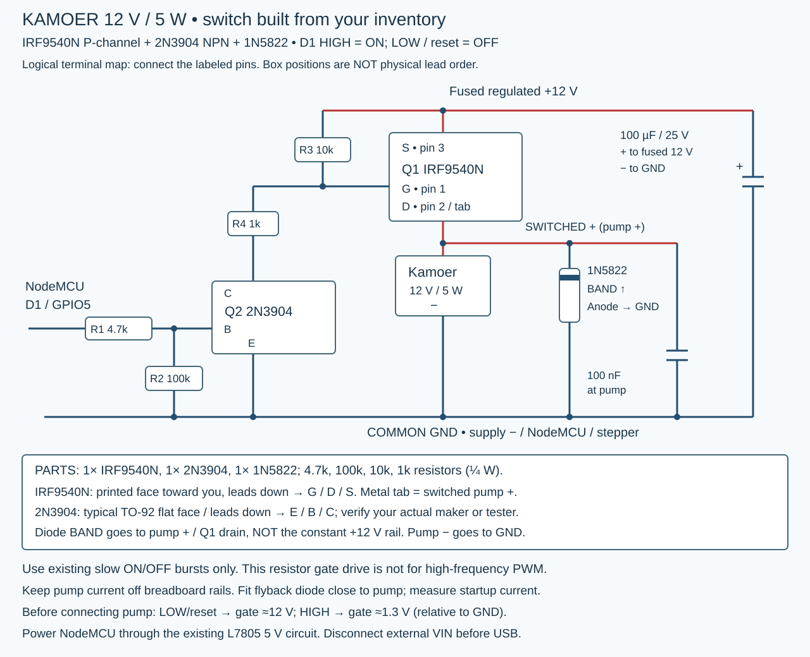
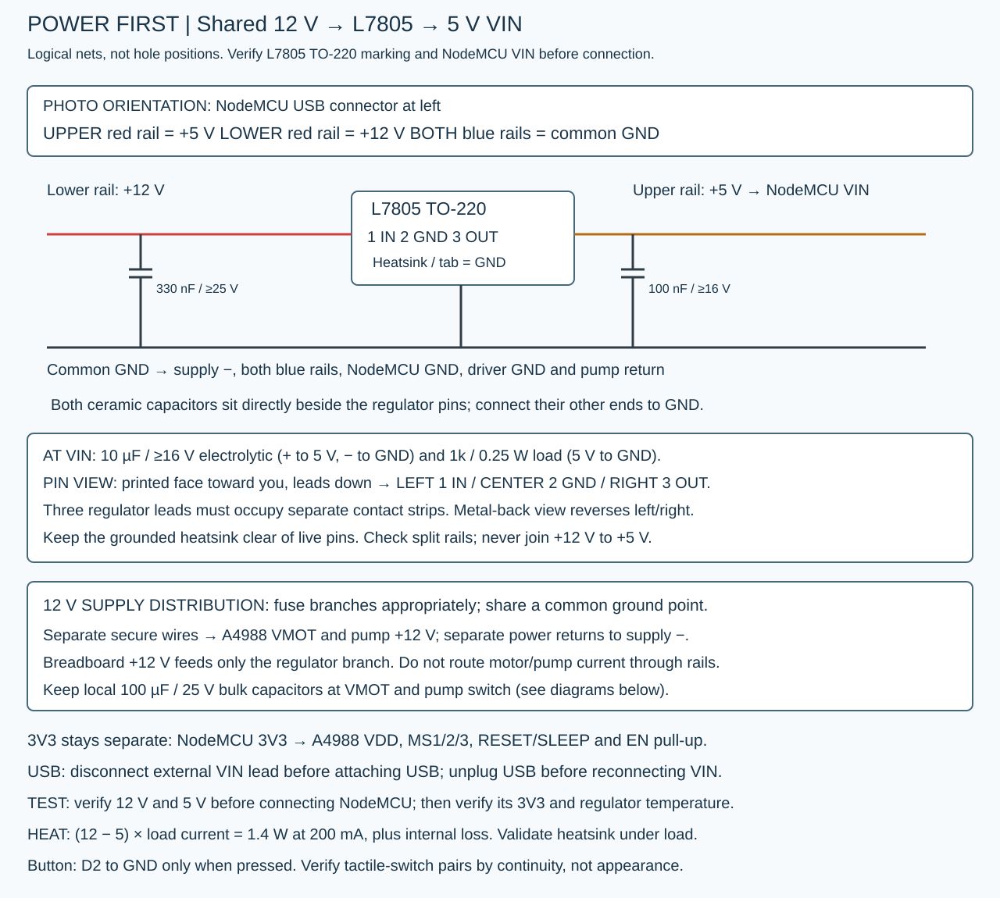

# Water pump: Kamoer NKP-DC-S10B

The supplied pump label reads **12 V, 5 W**. Use regulated 12 V DC. Dividing the nameplate values gives approximately 0.42 A; this is not a measured startup or stall current. The exact flow rate is unverified and must be measured with your tubing, lift and brass outlet installed.

## Switching circuit

Use **one IRF9540N P-channel MOSFET, one 2N3904 NPN transistor and one 1N5822 Schottky diode** from the photographed inventory. This replaces the previous AO3400A low-side circuit with a high-side switch. Do not reuse the old source/drain or diode connections. The existing firmware remains active HIGH: D1 HIGH turns the pump ON; LOW or a floating/reset GPIO turns it OFF through the external resistors.

| Part / connection | Destination |
|---|---|
| Q1 IRF9540N source (pin 3) | Fused regulated +12 V |
| Q1 drain (pin 2 and metal tab) | Pump positive, the switched-positive net |
| Pump negative | Common GND |
| R3: 10k ohm | Q1 gate to Q1 source (+12 V); holds switch OFF |
| R4: 1k ohm | Q1 gate to Q2 collector |
| Q2 2N3904 emitter | Common GND |
| R1: 4.7k ohm | NodeMCU D1 / GPIO5 to Q2 base |
| R2: 100k ohm | Q2 base to Q2 emitter / GND |
| 1N5822 cathode (band) | Pump positive / Q1 drain, NOT constant +12 V |
| 1N5822 anode (unbanded end) | Pump negative / GND |
| 100 nF ceramic | Across pump terminals, close to motor |
| 100 µF, 25 V electrolytic | + to fused constant 12 V, − to GND near switch |
| Supply negative | NodeMCU GND and stepper supply GND |

All four resistors can be ¼ W. The capacitor values are retained from the existing circuit; their availability was not established by the transistor/diode photos. Choose the branch fuse from measured startup current and wire capacity.

**Physical pins:** IRF9540N TO-220, printed face toward you and leads down: left gate, center drain, right source. Its exposed tab is drain (switched pump positive), not ground. A typical onsemi 2N3904 TO-92 is E–B–C with flat face toward you and leads down. The kit manufacturer is unverified: check actual markings/manufacturer pinout or a component tester before soldering. Do not assume a BC337 or 2N2222 has the same lead order.

**Why this circuit:** the photographed IRF-series N-channel parts are not selected for direct 3.3 V gate drive. The 2N3904 instead pulls the P-channel gate down through 1k. With 12 V and approximately 0.2 V at the collector, gate voltage is about 1.27 V, giving VGS ≈ −10.73 V. IRF9540N on-resistance is specified at −10 V (0.117 ohm maximum at the datasheet test conditions). At the nameplate-derived 0.417 A, the estimated conduction loss is about 0.020 W at that resistance; this is not a startup/stall or hot-device guarantee. GPIO base current is about 0.55 mA; steady collector current is about 1.07 mA. No firmware inversion is required. This resistor gate drive is for the existing slow timed bursts, **not high-frequency PWM**.

The 1N5822 is rated 3 A / 40 V under datasheet conditions. Keep its flyback loop short. The kit's 1N4148 is not the motor flyback choice. No Zener is required for this regulated-12-V circuit; do not substitute a higher supply voltage. Power NodeMCU VIN from the L7805 5 V output per [the shared-supply guide](WIRING.md). Never apply 12 V to VIN, GPIO or 3V3; disconnect external VIN before USB. Pump power bypasses the L7805.

### Electrical checkout

1. Power off: verify Q1/Q2 pin identities, separate nets, resistor values, diode band and capacitor polarity. Keep the pump disconnected.
2. Apply regulated 12 V with current limiting. At LOW/reset, Q1 gate should be approximately 12 V relative to GND (VGS ≈ 0). During the existing `p` command it should fall to about 1.3 V (VGS ≈ −10.7 V), then return to 12 V. An unloaded drain may float; temporarily connect 10k from drain to GND to check output switching.
3. Power off and connect the pump and its protection. Test with water using `p`, then reset the controller and verify the pump stays OFF. Check startup current, rail dips and device temperature before longer operation. Hardware testing has not been performed for this design.

A regulated 12 V supply with about 2 A capacity is a reasonable pump-branch starting point, subject to measured startup current. If sharing the stepper supply, it must be 12 V with enough combined capacity. A higher-voltage stepper supply requires a separate regulated 12 V supply or suitable buck converter for this pump. Add a branch fuse selected for measured startup current and wire capacity. Route pump current through secure soldered/terminal connections, not GPIO or thin breadboard rails.

The photo does not establish motor-terminal polarity for the desired pumping direction. Test briefly with water and the protected circuit; reverse the two motor leads with power off if needed. The flyback diode always stays band-to-switched-pump-positive / Q1 drain. Do not reverse the supply or diode.

## Automatic operation

The pump starts OFF. Starting the machine also enables timed water bursts while the bowl rocks. It turns off during centering, settling, spinning, rest and stopping. Controlled stop shuts water off immediately while the bowl decelerates. Automatic water resumes on the next rocking batch. It does not pulse anew at every direction reversal.

| Active preset | Pump ON | Pump OFF |
|---|---:|---:|
| LOW | 0.50 s | 4.50 s |
| MEDIUM | 0.75 s | 4.25 s |
| HIGH | 1.00 s | 4.00 s |

Each rocking batch begins with an ON interval. These are full-12-V bursts, not reduced-voltage PWM. Short phases can truncate intervals, so total flow cannot be inferred simply from a nominal duty percentage. Edit `PUMP_SCHEDULE` in `include/Config.h` after measuring. Start with LOW and observe drainage; the defaults are experimental, not a hydraulic recovery model.

Serial Monitor at 115200 baud accepts single characters:

| Command | Action |
|---|---|
| `p` | Prime for 3 seconds, only while machine idle |
| `c` | Calibration run for 30 seconds, only while idle |
| `w` | Toggle automatic water; turns current pump output off |
| `x` | Cancel water immediately and stop motion with deceleration |
| `!` | Cancel water and immediately disable stepper drive |
| `?` | Report motion and water status |

Repeated `p`/`c` cannot extend an active manual run. A long button press that starts motion cancels manual dispensing first. A short press still selects the motion/water preset. Automatic-water preference resets to enabled at boot; no flash writes occur.

## First water test and calibration

1. Install the new lid following [the illustrated lid instructions](../mechanical/lid_water/README.md). Secure hoses independently of the lid.
2. With motion stopped, put the outlet in a measuring cup. Use `p` to prime the complete line. Check direction and leaks.
3. Use `c`; collect 30 seconds of water. Measured mL multiplied by two estimates continuous full-on mL/min at this lift. Startup and short-burst behavior can differ.
4. Reinstall the brass tube to its positive seat and run LOW with water only. Measure delivered water over several complete batches and check the catcher drains faster than inflow. Adjust burst duration if needed.
5. Check MOSFET, wiring and pump temperature and startup reliability before adding material. Keep the clean-water reservoir below the outlet where practical; test for siphoning after shutdown. Stopping the motor is not a certified fluid shutoff valve.

There is no flow sensor, reservoir sensor or overflow switch. Software cannot detect an empty reservoir, blocked drain, disconnected tube or failed switch. Unattended operation and gold recovery have not been validated.
