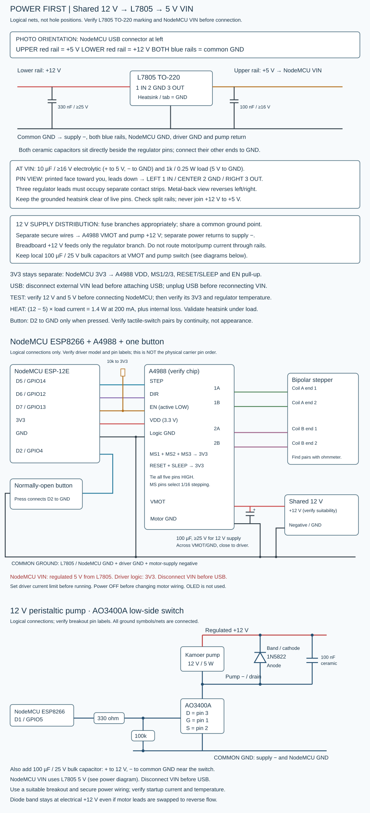

# Wiring: ESP8266 NodeMCU + assumed A4988 + bipolar stepper

The photograph clearly reads ESP-12E / ESP8266MOD. Use the NodeMCU D-labels below, not pin positions counted from a photo. The driver chip cannot be read under the heatsink; **verify A4988 and the carrier labels before using this wiring**. The schematic is logical, not a physical pin-layout drawing. Do not infer carrier orientation from potentiometer location or PCB color.

## Driver signals and power

| A4988 terminal | Connect to |
|---|---|
| STEP | NodeMCU D5 / GPIO14 |
| DIR | NodeMCU D6 / GPIO12 |
| EN / ENABLE | NodeMCU D7 / GPIO13; also 10k resistor to 3V3 |
| VDD | NodeMCU 3V3 |
| Logic GND | NodeMCU GND |
| MS1, MS2, MS3 | Each to 3V3, selecting 1/16 microsteps on A4988 |
| RESET and SLEEP | Tie together AND connect to 3V3; do not leave RESET floating |
| VMOT | Separate motor supply positive; 12 V is a typical starting supply for an A4988, after verification |
| Motor-power GND | Motor supply negative; join logic/NodeMCU ground |
| 1A, 1B | The two wires of one motor coil |
| 2A, 2B | The two wires of the other motor coil |

Add a **100 µF electrolytic capacitor rated at least 25 V for a 12 V supply** directly between VMOT (+) and motor GND (-), with short leads and correct polarity. Pololu specifies at least 47 µF to reduce LC spikes; 100 µF is the chosen starting value. Use an appropriately higher voltage rating for any higher supply. Do not distribute motor coil current through thin solderless-breadboard power rails; use short, secure motor/power connections and a soldered carrier/header arrangement. Keep motor wiring away from the button line.

Power the NodeMCU over USB. Do not put 12 V on its 3V3, USB, GPIO or VIN pins. Grounds must share a reference even though supplies are separate. Avoid D3/GPIO0, D4/GPIO2 and D8/GPIO15 for these external signals because of ESP8266 boot strapping. D4 may drive the onboard LED internally.

The external EN pull-up keeps the driver disabled while the MCU boots or resets. Firmware alone cannot control a floating pin during reset. If logic power is absent, do not assume the GPIO can keep the driver disabled; use the motor supply disconnect when working on wiring.

## Button

Use a normally-open button between **D2 / GPIO4 and GND**. The internal pull-up is enabled; no external resistor is necessary for short local wiring. Four-leg tactile switches have two internally connected pairs. With power off, use continuity mode to find two pins that connect only when pressed. A same-side pair may be permanently shorted, so do not choose pins by appearance. Disconnect the pictured OLED during initial setup; its pinout and controller are not established and it is not used by this firmware.

## Motor coil identification and current limit

Disconnect all power before changing motor connections. Never unplug the motor while the driver is energized.

Use an ohmmeter to find the two independent pairs with winding resistance. Wire one pair to 1A/1B and the other to 2A/2B. Do not trust motor wire colors. Swapping the two wires within one coil reverses rotation, or use the software direction flag. The photo does not establish the motor's connector pinout.

For a verified A4988, the nominal current-limit equation is `I_limit = VREF / (8 * Rsense)`. Read the actual sense resistor value on your carrier. Examples: R050 means 0.050 ohm, R100 means 0.100 ohm. For illustration only, a 0.50 A limit gives VREF = 0.20 V with R050, or 0.40 V with R100. These are not a recommended rating for this unidentified motor/clone. Choose a limit no higher than the motor's verified phase rating and the carrier's thermal capability. Follow the carrier manufacturer's adjustment procedure; a slip of the probe or screwdriver can short adjacent pads.

Firmware cannot adjust A4988 current through STEP/DIR. Supply current is not the same as winding current. The heatsink alone does not establish continuous-current capability; ensure it cannot short exposed pins and check cooling. Coils remain enabled during running settle/rest periods; they are disabled after a stop.
