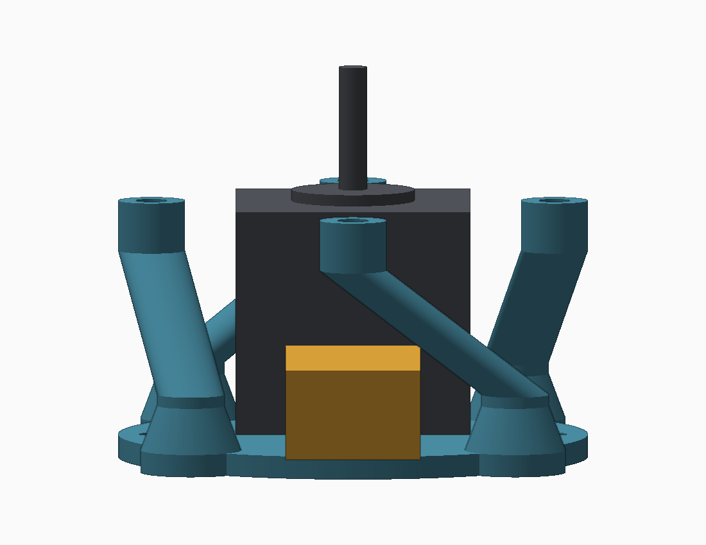

# P01 reinforced base with motor harness clearance

[Print STL](P01_base_cable_clearance.stl) · [Editable STEP](P01_base_cable_clearance.step) · [Reference assembly STEP](base_motor_deck_reference.step)

**Reprint P01 only. Keep your existing P02 upper motor deck.** This revision addresses the photographed lower support blocking access to the motor connector. The source and connector-clearance assumptions are included so future changes can use explicit dimensions.

## Changes and preserved interfaces

| Feature | Original P01 | Revised P01 |
|---|---|---|
| Lower post positions | Radius 36 mm, angles 0/90/180/270° | Radius 41 mm, angles 45/135/225/315° |
| Post section | 9 mm diameter | 12 mm diameter horizontal sections |
| Post feet | Straight 9 mm post to plate | 18 mm round foot, tapering to 12 mm over Z=4–12 mm |
| Support route | Straight vertical | Lower diagonal positions to Z=14; angled transition to original top positions at Z=37; vertical to Z=46 |
| Top mounting positions | Radius 36 mm, angles 0/90/180/270° | **Unchanged** |
| Top mounting surface | Z=46 mm | **Unchanged** |
| M4 insert pilot | 5.6 mm diameter, 6.5 mm deep | **Unchanged** |
| Main base disk | 84 mm diameter × 4 mm thick | **Unchanged**, with rounded foot extensions at the diagonals |
| Base anchor holes | Four 4.5 mm holes at radius 36, diagonal angles | Four 4.5 mm holes at radius 36, cardinal angles |
| Cable tie slots | Two 3 × 7 mm slots | Retained |

The lower supports move 45°, but their upper ends return to the existing holes. Rotating four straight posts would require a new upper plate. The angled arrangement is what permits this single-part replacement. The feet extend to a nominal 50 mm radius along diagonal directions; the overall X/Y bounds remain approximately 84 × 84 mm. Do not interpret the 84 mm bounds as an unchanged circular footprint.

The anchor holes in the bottom plate have moved because the new feet occupy their old locations. If the base is screwed to a board, mark new anchor holes. These are separate from the unchanged upper-deck screw locations.

## Printing and assembly

1. Print the STL at 100%, flat plate on the bed. Millimeters, no scaling. PETG with approximately 0.2 mm layers and at least five perimeters is a starting point. Use generous infill in the supports and feet.
2. **Review supports in the slicer.** The angled transition is approximately 52° from vertical; its underside may need localized/tree supports from the bed. Do not assume it prints support-free. Keep supports removable from the motor bay and insert holes.
3. Remove all supports and inspect the feet and sloping braces for poor bonding or voids. This geometry has not been physically load-tested. Increased diameter and flared roots are reinforcement choices, not a measured strength rating.
4. Install four M4 heat-set inserts at the top, nominally 6 mm OD × 6 mm long in 5.6 mm pilots, matching the original fit coupon/your actual inserts. Seat square and flush. Use new inserts or carefully recovered inserts that remain undamaged.
5. With power disconnected, remove the old base. Keep the motor and P02 upper deck together. Transfer the original top attachment screws, confirming engagement without bottoming out; the mounting height and holes have not changed.
6. Route and connect the harness through an open lower bay before tightening everything. Strap the cable to the tie slots with slack at the plug. Check the connector latch and cable bend are accessible without load on the socket.
7. Hand-turn the shaft/bowl, check all clearances, then perform an empty LOW-speed test. No firmware or water-path change is required.

## Clearance and verification

The assumed motor body is a conservative 42 × 42 × 40 mm square envelope, from Z=6 to Z=46. Connector insertion paths were checked on all four motor faces: **24 mm wide, Z=6–22 mm (16 mm high), extending radially from 21 to 66 mm**. These are design allowances, not measurements of your plug. The photos establish interference, not dimensions. A larger/off-center connector or a stiff cable with a larger bend radius requires checking against the model.

The original motor and P02 STEP references have no volumetric intersections with the revised base. Nominal top screw axes remain aligned/open. The part is one valid solid; the exported STL has closed, consistently oriented edges and positive volume. Five exported-mesh views plus assembled views are supplied. See [checks.json](checks.json) and [hardware reference](../../docs/HARDWARE.md).

This is a CAD and visual review, not a physical fit, fatigue or vibration test. No guarantees are made for unmeasured connector dimensions or print strength.

## Regeneration

Use Python with CadQuery 2.7, NumPy, SciPy and Pillow. Run `python build_base.py` from this folder. The script loads the original motor/deck references from `../gold_poc_v2/STEP`, exports STL/STEP and the reference assembly, checks intersections/mesh topology, and renders review images. It overwrites generated files in this revision directory. `base_motor_deck_reference.step` contains the new base plus reference motor and existing deck only, not the entire separator.
