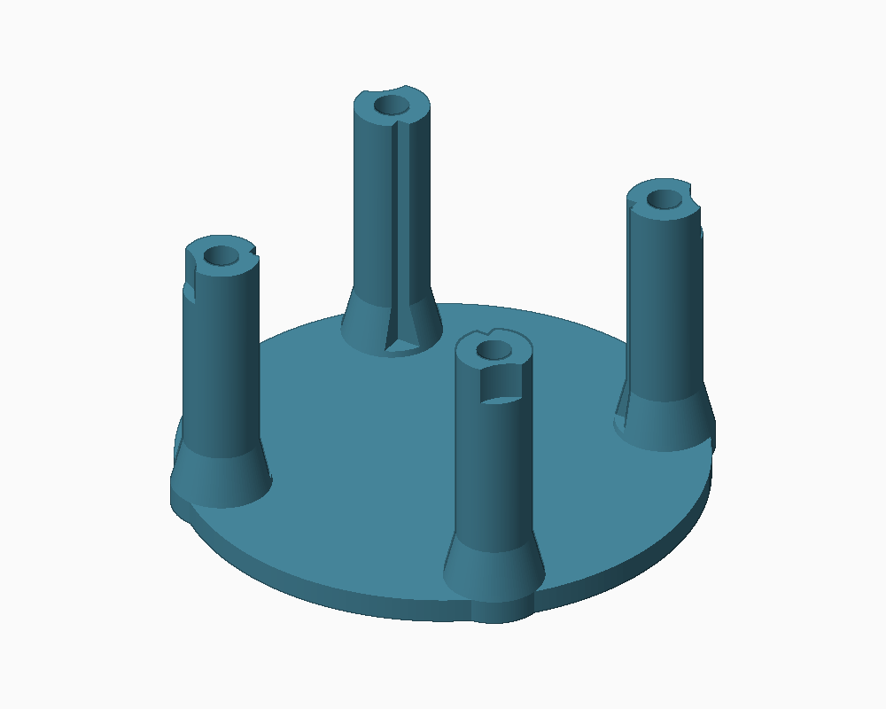
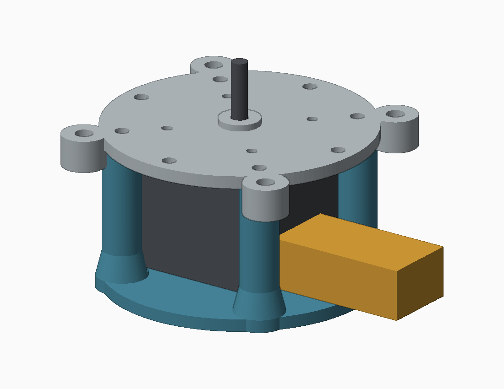

# P01 straight-post base: corrected revision

[Base STL](P01_base_cable_clearance.stl) · [Base STEP](P01_base_cable_clearance.step) · [Drill-template STL](P02_drill_template.stl)

**This replaces the rejected angled/swirl-post design. All four post axes are now straight and vertical.** The lower and upper ends occupy the same diagonal positions, 45° from the original post layout. The base has no unused anchor holes or cable-tie slots.

**Keep your printed P02 upper plate, but drill four new 4.5 mm clearance holes in it.** The old upper screw holes are at the cardinal positions. They cannot fasten straight diagonal posts. This is not a drop-in replacement against an unmodified P02. If you do not want to drill it, do not print this revision on the assumption that its holes already match.

## Dimensions and changes

| Feature | Corrected geometry |
|---|---|
| Main plate | 84 mm diameter, 4 mm thick |
| Post axes | Radius 35.5 mm, angles 45/135/225/315°; vertical throughout |
| Post section | 12 mm nominal diameter; original posts were 9 mm |
| Feet | 16 mm nominal diameter, taper to 12 mm over Z=4–12 |
| Top height | Z=46 mm, same height as original base |
| M4 insert pilot | 5.6 mm diameter, 6.5 mm depth |
| New upper plate holes | 4.5 mm diameter at X/Y = ±25.1023 mm (all four combinations) |
| Motor clearance | 44 × 44 mm internal relief around assumed 42 × 42 mm motor |
| Existing deck bosses | Local curved relief at post tops, radius 7.3 mm about the original R47 boss centers |
| Extra bottom holes | Removed |

The inward post/foot faces are locally relieved to clear the motor corners. A small curved relief at each post top clears the existing upper plate's underside mounting boss. These are clearance cuts in straight vertical posts, not angled arms. Feet have rounded plan outlines; no supports should be required for the base in its supplied flat orientation, but inspect your slicer preview.

## What the old holes were

The original P01 had two rectangular 3 × 7 mm slots for cable ties/strain relief. No printed part was intended to fit them. Its four round bottom holes were optional base anchoring holes, not required separator assembly interfaces. Both sets are removed from this corrected base. The required M4 insert pockets remain at the post tops.

## Print and fit

1. Print the base flat at 100% in millimeters. PETG, approximately 0.2 mm layers and at least five perimeters are starting settings. Review infill and layer bonding around the feet. No physical strength test has been performed.
2. Fit four M4 heat-set inserts, assuming approximately 6 mm OD × 6 mm long, after checking your actual inserts against the original coupon. Let them cool; inspect the locally relieved post tops for damage.
3. Disconnect power and remove the motor and upper components from P02 before drilling. Keep debris out of bearings, motor and electronics.
4. Print the 3 mm thick drill template. Its four cardinal holes at radius 36 mm align with the old base screw holes. Locate it on the **top face** of P02 using two opposite old holes and temporary M4 screws; clamp the plate flat on scrap wood. The template's center opening clears the central pedestal. Do not confuse its locating holes with the four new diagonal holes.
5. Mark the four new diagonal centers through the template. Remove the template, check spacing (50.2046 mm square), then drill 4.5 mm through P02's 4 mm plate only. Deburr. The template is a positioning aid, not a hardened drill bushing; do not melt it with a powered bit. Existing outer bosses/catcher holes must remain untouched.
6. Reassemble using the original four M4 × 10 mm deck-to-base screws in the **new** holes. Confirm insert engagement and that the screws do not bottom out. The four old deck clearance holes are now unused; leaving them open does not change the dry deck's function.
7. Connect the harness through the open face between posts and confirm plug/latch access and cable bend clearance. Hand-turn the rotor, then test empty at LOW. Firmware is unchanged.

## Checks and reference files

CAD checks verify one valid base solid, closed/oriented STL, and no volumetric intersection with the motor envelope, drilled deck or 24 mm-wide × 16 mm-high assumed connector corridors (Z=6–22) on any of four faces. Connector dimensions remain unmeasured. Review images show the actual exported STL. `checks.json` records results.

`P02_drilled_reference.step` shows the **existing plate with four new holes**, for inspection, not a request to reprint it. `base_motor_deck_reference.step` includes the corrected base, reference motor and drilled deck. `P02_drill_template.step` is editable template geometry. The main kit's original PDF and assembly STEP remain historical snapshots; these instructions supersede their base attachment step.

Run `python build_base.py` with CadQuery 2.7, NumPy, SciPy and Pillow to regenerate. Original references come from `../gold_poc_v2/STEP`. Print tolerances, actual cable fit and structural performance require physical verification.
