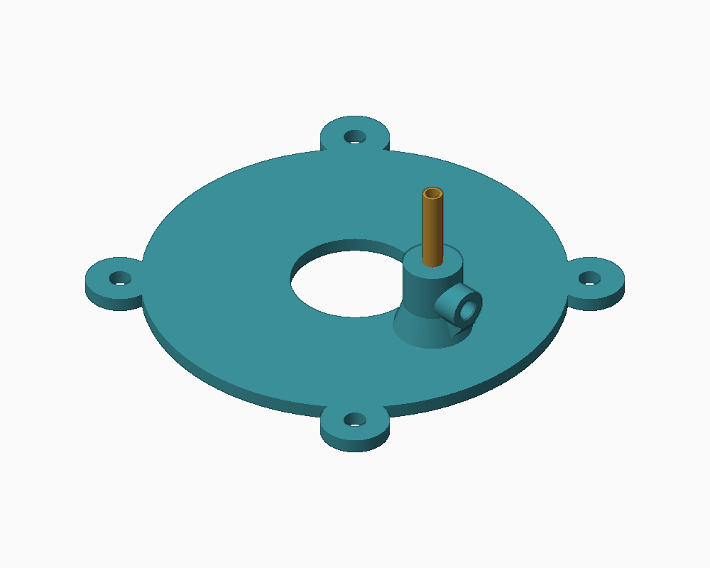
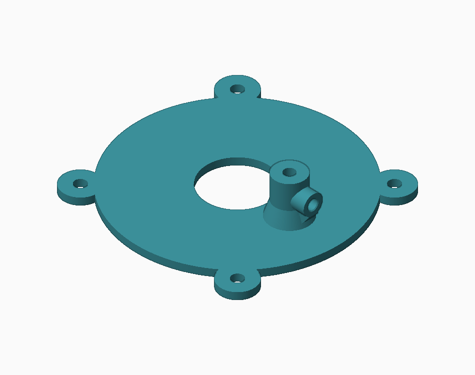
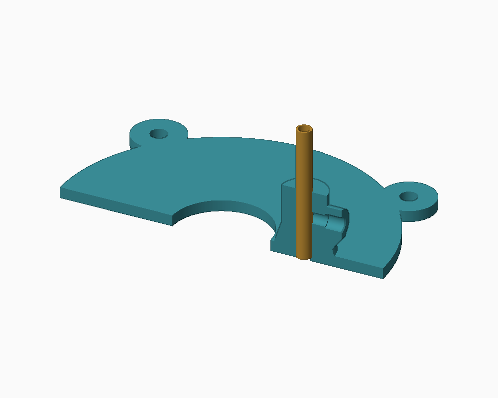

# P08 replacement lid — 4 mm brass water inlet

[Print STL](P08_lid_brass_4mm.stl) · [Editable STEP](P08_lid_brass_4mm.step)

Only the lid changes. Original 86 mm body, 26 mm material-feed opening and four M4 mounting positions are retained. The old spare water hole is closed. The supported inlet is 22 mm off center; it does not aim directly into the central concentrate trap.

## 1. Print the lid

Print the STL as supplied, flat underside on the bed, without scaling. PETG, 0.2 mm layers and at least five perimeters are a practical starting point. Overall height is 19 mm. Inspect the horizontal insert bore for bridge sag; use localized support if your printer requires it. Remove burrs without thinning the water passage. Printed plastic is not automatically watertight: water-test before installing electronics underneath.

## 2. Fit the insert

The radial boss accepts **one M3 heat-set insert approximately 4.5 mm OD × 4 mm long**, using a nominal 4.0 mm pilot, 4.5 mm deep. Measure your inserts first; other sizes require changing `build_lid.py` and regenerating. Heat-set from the outside, square to the bore and flush with the boss. Do not push into the brass socket. Let cool before threading.

## 3. Seat the brass tube

Deburr a starting length of **35 mm**, 4 mm OD / 3 mm ID brass tube. Insert vertically until it seats: the 4.2 mm socket supports **18 mm** of tube, leaving about 17 mm above the collar for the flexible hose. A **3.2 mm water passage** below the shoulder lets water out while physically preventing the 4 mm tube from dropping through into the rotor. Do not drill the socket through the shoulder.

If necessary, carefully hand-fit the long socket to your actual tube. A small amount of fully cured, compatible silicone at the seat can seal seepage; keep the water passage clear. This is an open discharge, not a pressure-rated fitting.

## 4. Retain and connect

Install **one M3 × 8 mm socket-head screw** into the insert and tighten only enough to retain the tube. Its 0.5 mm wall can be crushed. Slip compatible flexible pump outlet hose onto the exposed brass; confirm a secure fit with your actual hose ID and material. Support the hose separately so it cannot lever on the collar. The shoulder, not the screw, sets tube depth.

## 5. Replace the lid

Refit using the existing four M4 lid screws/inserts (original nominal M4 × 8 mm). Check actual screw engagement and clearances. Hand-turn the bowl with power disconnected, then test water only. No brass projects below the lid underside.

## Verification and regeneration

CAD is one valid solid; STL is closed and consistently oriented, 17,854 triangles. Lid, seated brass and nominal M3 screw have no intersections with the original P04 catcher or P06 bowl. Four mesh views and a section were visually reviewed. These are digital checks, not a verified physical print or pressure test. See [checks.json](checks.json).

Install Python dependencies `cadquery numpy scipy pillow` (generated with CadQuery 2.7). Run `python build_lid.py /path/to/original/STEP` to also check the original P04/P06 clearances, or omit that argument to regenerate the part alone. STEP uses original assembly coordinates; STL is translated for printing. The model does not change the bowl or establish separation efficiency.
